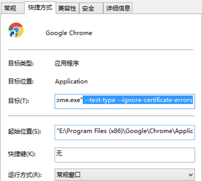
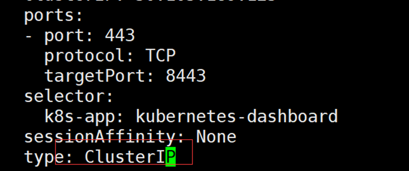
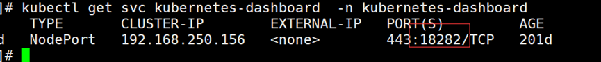
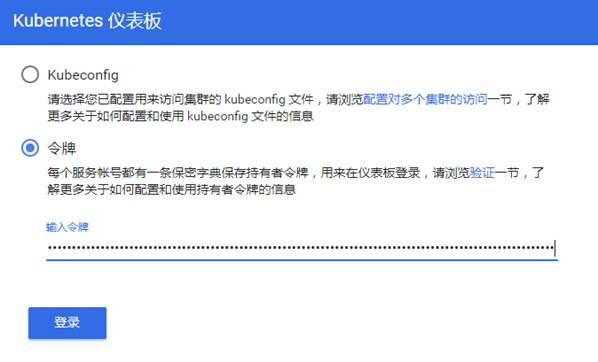

Dashboard用于展示集群中的各类资源，同时也可以通过Dashboard实时查看Pod的日志和在容器中执行一些命令等。
### 开启自动生成Token（1.24版本上必做）
如果安装的K8s版本是1.24以上的（包含1.24），需要修改apiserver的以下配置：
所有master节点修改apiserver配置：
vim /etc/kubernetes/manifests/kube-apiserver.yaml
然后在这个文件的command参数的第二行，添加 --feature-gates=LegacyServiceAccountTokenNoAutoGeneration=false （如果有feature-gates参数，直接在后面添加,LegacyServiceAccountTokenNoAutoGeneration=false即可。

同样的方式修改controller-manager：
vim /etc/kubernetes/manifests/kube-controller-manager.yaml
之后重启kubelet，然后安装dashboard即可
systemctl restart kubelet

### 安装指定版本dashboard
```shell
cd /root/k8s-ha-install/dashboard/
kubectl  create -f .

```

### 安装最新版
官方GitHub地址：https://github.com/kubernetes/dashboard
可以在官方dashboard查看到最新版dashboard
kubectl apply -f https://raw.githubusercontent.com/kubernetes/dashboard/v2.0.3/aio/deploy/recommended.yaml
2.0.3 以具体版本号为例
vim admin.yaml

apiVersion: v1
kind: ServiceAccount
metadata:
  name: admin-user
  namespace: kube-system
---
apiVersion: rbac.authorization.k8s.io/v1
kind: ClusterRoleBinding 
metadata: 
  name: admin-user
  annotations:
    rbac.authorization.kubernetes.io/autoupdate: "true"
roleRef:
  apiGroup: rbac.authorization.k8s.io
  kind: ClusterRole
  name: cluster-admin
subjects:
- kind: ServiceAccount
  name: admin-user
  namespace: kube-system
kubectl apply -f admin.yaml -n kube-system

### 登录dashboard
在谷歌浏览器（Chrome）启动文件中加入启动参数，用于解决无法访问Dashboard的问题，参考图1-1：
--test-type --ignore-certificate-errors


更改dashboard的svc为NodePort：
kubectl edit svc kubernetes-dashboard -n kubernetes-dashboard

将ClusterIP更改为NodePort（如果已经为NodePort忽略此步骤）：
查看端口号：
kubectl get svc kubernetes-dashboard -n kubernetes-dashboard


根据自己的实例端口号，通过任意安装了kube-proxy的宿主机的IP+端口即可访问到dashboard：
访问Dashboard：https://10.103.236.201:18282（请更改18282为自己的端口），选择登录方式为令牌（即token方式），参考图

### 查看token值：
```shell
kubectl -n kube-system describe secret $(kubectl -n kube-system get secret | grep admin-user | awk '{print $1}')

```
