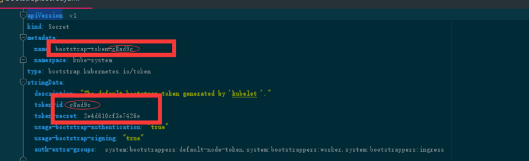

## 介绍
由于控制节点数量有限，手工颁发证书没有问题，但worker节点数量可能会很多，手工颁发证书可能会很麻烦。所以使用TLS Bootstrapping来解决这个问题
### 配置思路
1. 生成bootstrap-kubelet.kubeconfig文件
2. 创建TLS Bootstrapping使用的RBAC和secret等资源
3. 在kubelet启动配置文件中，指定使用bootstrap-kubelet.kubeconfig文件，kubelet启动时使用该文件自动生成证书。
### 只需要在Master01创建bootstrap
```shell
cd /root/k8s-ha-install/bootstrap
kubectl config set-cluster kubernetes \
  --certificate-authority=/etc/kubernetes/pki/ca.pem \
  --embed-certs=true \
  --server=https://10.1.1.10:6443 \
  --kubeconfig=/etc/kubernetes/bootstrap-kubelet.kubeconfig
  
kubectl config set-credentials tls-bootstrap-token-user \
  --token=c8ad9c.2e4d610cf3e7426e \
  --kubeconfig=/etc/kubernetes/bootstrap-kubelet.kubeconfig
  
kubectl config set-context tls-bootstrap-token-user@kubernetes     \
  --cluster=kubernetes     \
  --user=tls-bootstrap-token-user     \
  --kubeconfig=/etc/kubernetes/bootstrap-kubelet.kubeconfig
  
kubectl config use-context tls-bootstrap-token-user@kubernetes \
  --kubeconfig=/etc/kubernetes/bootstrap-kubelet.kubeconfig
#注意：如果要修改bootstrap.secret.yaml的token-id和token-secret，需要保证下图红圈内的字符串一致的，并且位数是一样的。还要保证上个命令的黄色字体：c8ad9c.2e4d610cf3e7426e与你修改的字符串要一致

```

### 将admin的凭证文件，拷贝至家目录
```shell
mkdir -p /root/.kube ; cp /etc/kubernetes/admin.kubeconfig /root/.kube/config
```
### 验证集群状态，并创建TLS bootstrapping
```shell
kubectl get cs
cd /root/k8s-ha-install/bootstrap
kubectl create -f bootstrap.secret.yaml 
```

